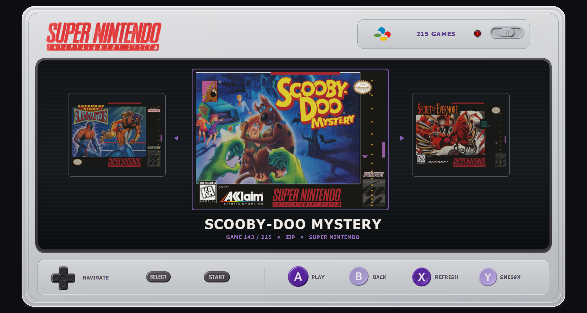

# SUPER LIBRARY
### An independent SNES library interface for Snes9x

**A console-like Windows frontend focused on browsing, organizing and launching a Super Nintendo library with Snes9x.**

## O que é o SUPER LIBRARY?

O **SUPER LIBRARY** nasceu da ideia de criar uma interface independente para o **Snes9x**: em vez de abrir o emulador, procurar arquivos e navegar por pastas sempre que quiser jogar, o usuário recebe uma experiência visual inspirada no próprio Super Nintendo.

O programa funciona como um **frontend/launcher**. Ele organiza a biblioteca, exibe as capas em um carrossel, permite navegar por controle, mouse ou teclado e inicia o jogo selecionado no Snes9x. O emulador continua sendo um projeto separado e pode ser instalado automaticamente pelo próprio SUPER LIBRARY ou escolhido manualmente pelo usuário.

> **Importante:** o SUPER LIBRARY **não inclui ROMs comerciais e não oferece download de ROMs**. Use apenas jogos obtidos e mantidos de acordo com as leis aplicáveis na sua região.

---

## Download

Baixe sempre a versão mais recente pela página **Releases** deste repositório.

**Arquivo recomendado:** `SUPER_LIBRARY_Setup_v1.0.0.exe`

Se houver somente um arquivo para baixar, ele deve ser **o instalador**, e não o `SuperLibrary.exe` isolado da pasta de instalação.

### Requisitos

- Windows 10 ou Windows 11 **64-bit**
- Resolução recomendada: 1280×720 ou superior
- Controle opcional USB ou Bluetooth reconhecido pelo Windows/SDL
- Internet somente para recursos online, como instalar/atualizar Snes9x, shaders e procurar capas
- **Python não é necessário** no computador do usuário

---

## Primeira configuração

1. Instale e abra o **SUPER LIBRARY**.
2. Clique em **SELECT** e escolha **Choose Folder** para apontar para sua pasta de ROMs, ou use **Import Collection** para criar uma biblioteca organizada a partir de uma coleção que você já possui.
3. Clique em **Y — SNES9X** e escolha **Download Snes9x and Shaders**.
   - Se você já possui Snes9x, escolha **Choose Existing**.
4. Aguarde a instalação/configuração do emulador e dos shaders.
5. Navegue pelos jogos e pressione **A / Cross** ou clique em **A — PLAY**.

Quando o Snes9x for fechado, o SUPER LIBRARY volta para a frente automaticamente.

### Atalho especial durante o jogo

Com um controle conectado, **segure R1 / RB por aproximadamente 1 segundo** para solicitar o fechamento do Snes9x e retornar ao SUPER LIBRARY.

---

## Controles — Gamepad

O programa usa a camada de controle do **SDL/pygame**. Controles reconhecidos como game controllers pelo Windows/SDL recebem o mapeamento normalizado abaixo.

| Ação | Xbox / XInput | PlayStation | Função |
|---|---|---|---|
| Navegar | D-Pad ←/→ ou analógico esquerdo | D-Pad ←/→ ou analógico esquerdo | Jogo anterior / próximo |
| Jogar | **A** | **Cross (×)** | Abre o jogo selecionado no Snes9x |
| Voltar | **B** | **Circle (○)** | Sai do fullscreen ou fecha o launcher quando em janela |
| Smart Refresh | **X** | **Square (□)** | Atualiza e repara a biblioteca com correspondências de alta confiança |
| Snes9x Manager | **Y** | **Triangle (△)** | Instalar, atualizar, reparar ou selecionar Snes9x |
| Música | **LB** | **L1** | Liga/desliga a música do launcher |
| Avanço rápido | **RB** | **R1** | No launcher: avança 5 jogos |
| Sair do jogo | **RB — segurar ~1 s** | **R1 — segurar ~1 s** | Durante o jogo: fecha Snes9x e retorna ao launcher |
| Configurar emulador | **Menu / Start** | **Options** | Abre Snes9x sem ROM para configuração; pressione novamente para fechá-lo |
| Fechar launcher | **View / Back** | **Share / Create** | Fecha o SUPER LIBRARY |

### Controles compatíveis

A compatibilidade depende de o dispositivo ser reconhecido pelo Windows e pelo SDL. Em geral, o programa foi projetado para funcionar com:

- Xbox 360 / Xbox One / Xbox Series e outros controles XInput;
- DualShock 4 e DualSense;
- controles 8BitDo em modos compatíveis com Windows;
- muitos controles USB/Bluetooth genéricos.

Em controles genéricos sem um mapeamento SDL conhecido, a posição dos botões pode variar. Conectar o controle **antes de abrir o programa** costuma oferecer a experiência mais previsível, embora hot-plug/reconexão também sejam tratados pelo launcher.

---

## Controles — Mouse

Todos os principais botões desenhados na interface são interativos:

| Elemento | Função |
|---|---|
| D-Pad esquerdo/direito | Navega pelo carrossel |
| **SELECT** | Abre o menu da biblioteca de ROMs |
| **START** | Abre o Snes9x sem jogo para configuração |
| **A — PLAY** | Inicia o jogo selecionado |
| **B — BACK** | Volta / sai do fullscreen / fecha o launcher |
| **X — REFRESH** | Executa o Smart Refresh |
| **Y — SNES9X** | Abre o Emulator Manager |
| LED vermelho/cinza | Pausa ou retoma a música |
| POWER | Fecha o SUPER LIBRARY |

---

## Atalhos de teclado

O teclado é uma alternativa adicional para navegação rápida:

| Tecla | Ação |
|---|---|
| `←`, `A` ou `W` | Jogo anterior |
| `→`, `D` ou `↓` | Próximo jogo |
| `Enter`, `Return`, `Space` ou `S` | Jogar |
| `R` ou `X` | Smart Refresh |
| `F1` ou `Y` | Snes9x Manager |
| `Esc`, `Backspace` ou `Q` | Voltar / fechar |
| `Page Up` | Volta 5 jogos |
| `Page Down` | Avança 5 jogos |
| `F11` | Alterna fullscreen |

---

## Biblioteca de ROMs

O botão **SELECT** abre o menu **ROM Library**.

### Choose Folder
Aponta diretamente para uma pasta existente com ROMs compatíveis.

### Import Collection
Importa uma coleção que **já pertence ao usuário** para uma biblioteca separada e organizada. O importador pode trabalhar com pasta, ROM solta, ZIP de um jogo e pacotes ZIP com múltiplos jogos.

Perfis disponíveis:

- **PT-BR**
- **Auto / Mixed**
- **USA**
- **Europe**
- **Japan**

A deduplicação é feita pelo conteúdo real da ROM, e não apenas pelo nome do arquivo. Variantes realmente diferentes — tradução, revisão ou região — são preservadas.

### Scan This PC
Procura automaticamente uma pasta com ROMs SNES no computador e pede confirmação antes de usá-la.

### Create Organized Copy
Cria **cópias ZIP organizadas em outro diretório**. A coleção de origem permanece intacta.

### Find Missing Covers
Procura capas ausentes usando metadados e fontes online, priorizando correspondências confiáveis e capas frontais adequadas. Capas existentes não são substituídas indiscriminadamente.

---

## Smart Refresh

O **X — REFRESH** não é apenas um recarregamento visual. Ele é o mecanismo de manutenção da biblioteca.

Entre as tarefas que pode executar, sempre usando critérios de confiança elevados:

- recuperar nomes de capas reconhecidas pelo conteúdo;
- limpar duplicatas de capas reconhecidas;
- associar ROMs e capas por identidade, aliases, hashes e metadados;
- padronizar ROMs reconhecidas;
- converter ROMs soltas reconhecidas em ZIP validado;
- preservar conflitos e correspondências duvidosas em vez de adivinhar.

> **Atenção:** o Smart Refresh pode alterar fisicamente arquivos da biblioteca quando a correspondência é considerada segura. Se quiser uma opção totalmente não destrutiva, prefira **Create Organized Copy**, que trabalha em outro diretório.

---

## Snes9x Manager

O botão **Y — SNES9X** concentra o gerenciamento do emulador.

### Sem Snes9x configurado
- **Download Snes9x and Shaders** — instala a versão oficial atual e o pacote de shaders;
- **Choose Existing** — seleciona uma instalação de Snes9x que você já possui.

### Com instalação gerenciada
- verificar atualizações;
- instalar shaders ausentes;
- reparar a instalação;
- remover a instalação gerenciada;
- escolher outro Snes9x.

O SUPER LIBRARY consulta o repositório oficial do Snes9x e o projeto `libretro/slang-shaders` somente quando necessário. O aplicativo não desativa nem contorna proteções de segurança do Windows.

> **Ao remover uma instalação gerenciada**, todo o diretório gerenciado do Snes9x é apagado, incluindo configurações, saves, save states, screenshots e outros arquivos que estejam dentro dele. A biblioteca de ROMs e as capas ficam fora dessa operação.

---

## Música e indicador de energia

A interface possui música ambiente própria. Ela pode ser ligada/desligada de três formas:

- **L1 / LB** no controle;
- clique no **LED** da interface;
- a preferência fica salva para as próximas execuções.

Ao iniciar o Snes9x, a música do frontend é suspensa e volta quando o usuário retorna ao SUPER LIBRARY, respeitando a preferência salva.

---

## Principais recursos

- Interface independente inspirada na estética do SNES americano;
- carrossel visual de jogos com capa, título e contador;
- títulos longos com rolagem automática;
- suporte a mouse, teclado e gamepad;
- hot-plug e reconexão de controles USB/Bluetooth;
- inicialização e retorno automático do Snes9x;
- atalho R1/RB para sair do jogo e retornar ao launcher;
- gerenciamento de Snes9x e shaders;
- suporte a instalação externa de Snes9x;
- importação e deduplicação exata de coleções;
- perfis PT-BR e internacionais;
- criação de cópia organizada sem alterar a origem;
- busca inteligente de capas ausentes;
- Smart Refresh para manutenção da biblioteca;
- fullscreen;
- música e efeitos sonoros de interface;
- instalação autônoma: **o usuário não precisa instalar Python, PySide6 ou pygame**.

---

## Formatos de ROM reconhecidos

A biblioteca principal reconhece:

- `.zip`
- `.sfc`
- `.smc`
- `.fig`
- `.swc`

O importador também possui suporte de inspeção para alguns formatos/containers adicionais durante a organização. A capacidade de ler arquivos `.7z`/`.rar` pode depender das ferramentas de arquivamento disponíveis no próprio Windows; ZIP é o formato recomendado.

---

## Solução de problemas

### O programa abre, mas não mostra jogos
Use **SELECT → Choose Folder** e escolha a pasta correta. Verifique se existem arquivos em formatos reconhecidos.

### Não tenho Snes9x
Use **Y → Download Snes9x and Shaders**. Também é possível selecionar uma instalação existente.

### O controle não responde
1. confirme que o Windows reconhece o controle;
2. tente reconectar via USB/Bluetooth;
3. feche e abra o SUPER LIBRARY com o controle já conectado;
4. em controles genéricos, teste o modo XInput quando disponível.

### Quero sair do jogo sem pegar o mouse
Segure **R1 / RB por cerca de 1 segundo** enquanto o Snes9x estiver rodando.

### Meu antivírus mostrou um alerta
Não desative sua proteção. Confirme que o instalador veio da página oficial **Releases** deste repositório e compare o SHA-256 publicado na release. Consulte também [SECURITY.md](SECURITY.md).

Mais respostas: [FAQ.md](FAQ.md)

---

## Privacidade e rede

O SUPER LIBRARY trabalha principalmente com arquivos locais. Conexões de rede são usadas para funções explicitamente relacionadas a conteúdo online, como:

- consultar/baixar Snes9x oficial;
- consultar/baixar shaders;
- procurar metadados e capas ausentes.

O programa não inclui um serviço de download de ROMs comerciais.

---

## Projeto independente

SUPER LIBRARY é um projeto independente e não é afiliado, patrocinado ou endossado pela Nintendo, pelo projeto Snes9x, pelo projeto libretro ou por outros detentores de marcas/conteúdo mencionados.

Nintendo, Super Nintendo, SNES e marcas relacionadas pertencem aos seus respectivos proprietários. Snes9x e slang-shaders são projetos de terceiros e permanecem sujeitos aos seus próprios termos/licenças.

Veja [NOTICE.md](NOTICE.md).

---

## Versão

### **v1.0.0 — First Public Stable Release**

A numeração pública começa em **1.0.0**. As várias revisões usadas durante o desenvolvimento foram internas e não fazem parte do versionamento público.

[Changelog](CHANGELOG.md) · [Controles](CONTROLS.md) · [Guia rápido](QUICK_START.md) · [FAQ](FAQ.md)
